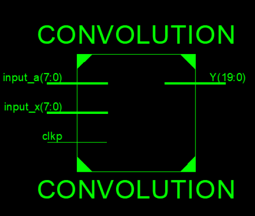
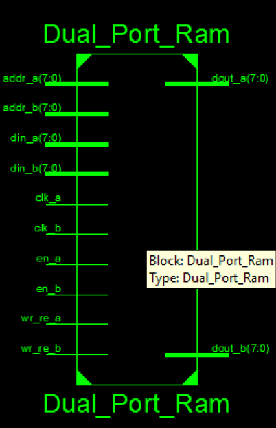
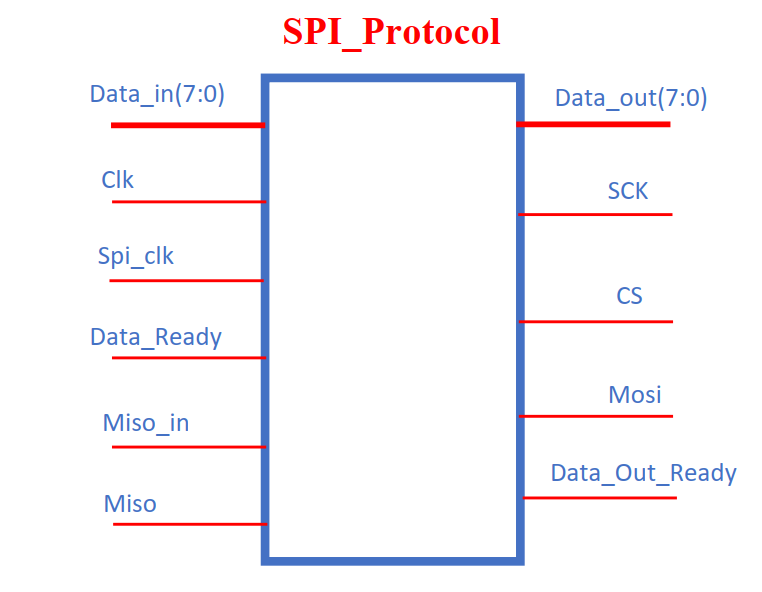
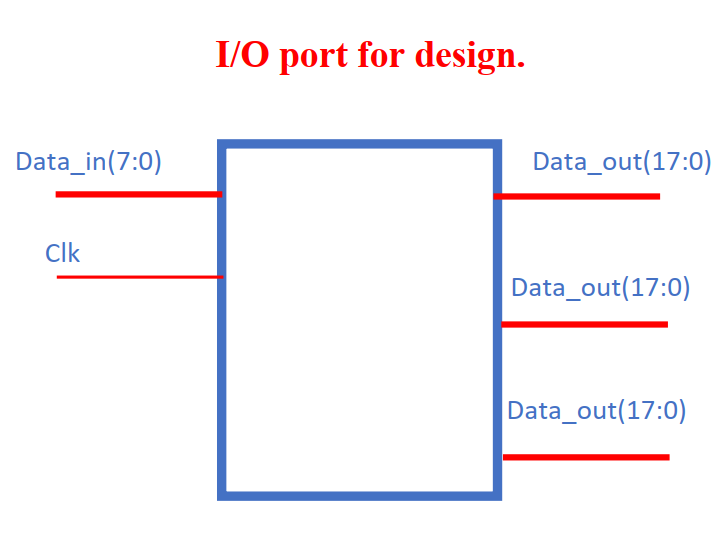

# FPGA Exercise

Welcome to the FPGA Exercise repository! This repository contains exercises and projects related to Field-Programmable Gate Arrays (FPGA).

## Description

In this course, we delve into various FPGA exercises aimed at understanding and implementing different functionalities. From basic operations to more complex protocols, this repository serves as a resource for learning and practicing FPGA programming.

## Projects

1. **Even_Odd Detector**
   
   Description: Implementing a circuit to detect whether a given number is even or odd.
   
2. **Simple Convolution**
   
   Description: Developing a basic convolution operation using FPGA.
   
   

3. **256 Byte Dual Port RAM**
   
   Description: Designing a dual-port RAM module capable of storing 256 bytes of data.
   
   

4. **SPI Protocol**
   
   Description: Implementing the Serial Peripheral Interface (SPI) protocol on FPGA.
   
   

5. **Matrix Multiplication Circuit**
   
   Description: Creating a circuit for matrix multiplication leveraging FPGA capabilities.
   
   

## How to Use

Each project is contained within its respective directory. You can navigate to each project's directory to find the necessary files and documentation. Follow the instructions provided within each project's directory to set up and run the project on your FPGA board or simulator.

## Contribution

Contributions to this repository are welcome! If you have any improvements, bug fixes, or additional exercises to add, feel free to fork this repository, make your changes, and submit a pull request. Please ensure that your contributions align with the overall goals and scope of the repository.

## License

This repository is licensed under the [MIT License](LICENSE). Feel free to use, modify, and distribute the contents of this repository for educational and non-commercial purposes.

---
